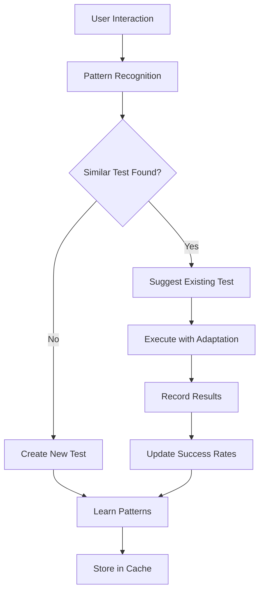

# Intelligent Test Persistence & Management

## 🎯 Overview

The Claude Playwright Toolkit now features a revolutionary **intelligent test management system** that automatically saves, rediscovers, and adapts tests to new contexts. This system leverages AI-powered pattern recognition and an advanced cache architecture for maximum efficiency.

## 🚀 Key Features

### ✨ **AI-Powered Test Intelligence**
- **Smart Pattern Recognition** - Automatic detection of recurring test patterns
- **Intelligent Search** - Semantic search for similar tests based on intent
- **Auto-Adaptation** - Tests automatically adapt to new URLs and contexts
- **Learning System** - System learns from successful test executions

### 🎯 **Zero-Overhead Workflow**
- Tests are automatically learned during normal work
- No manual test scripts required anymore
- Intelligent suggestions based on current activity
- Seamless integration into existing workflows

## 🛠 **MCP Tools (Claude Code Integration)**

### 🔧 **Core Test Management Tools**

#### `browser_save_test`
Saves current interaction sequence as a reusable test.

```json
{
  "name": "User Login Test",
  "description": "Complete user authentication workflow",
  "steps": [
    {
      "action": "navigate",
      "target": "https://app.example.com/login",
      "description": "Navigate to login page"
    },
    {
      "action": "type",
      "selector": "input[name='email']",
      "value": "user@example.com",
      "description": "Enter email address"
    },
    {
      "action": "click",
      "selector": "button[type='submit']",
      "description": "Submit login form"
    }
  ],
  "tags": ["authentication", "login"],
  "profile": "desktop"
}
```

#### `browser_find_similar_tests`
Finds similar tests using AI-powered search.

```typescript
// Example call
await browser_find_similar_tests({
  query: "user authentication workflow",
  url: "https://staging.app.com",
  limit: 3
});

// Response
{
  "results": [
    {
      "scenario": {...},
      "similarity": 0.87,
      "confidence": 0.92,
      "adaptationSuggestions": ["Adapt URL pattern", "Update selectors"]
    }
  ]
}
```

#### `browser_run_test`
Executes saved test with intelligent adaptation.

```typescript
await browser_run_test({
  testName: "User Login Test",
  adaptContext: {
    url: "https://production.app.com",
    profile: "mobile"
  }
});
```

#### `browser_test_library`
Shows complete test library with statistics.

#### `browser_suggest_actions`
Provides intelligent action suggestions based on learned patterns.

#### `browser_adapt_test`
Adapts existing tests for new contexts.

## 📱 **CLI Commands**

### 💾 **Test Storage**

```bash
# Interactive test creation
claude-playwright test save --name "User Registration" --tags "auth,signup"

# Load test from JSON file
claude-playwright test save --name "Complex Workflow" --file ./test-steps.json

# With specific options
claude-playwright test save \
  --name "E2E Shopping" \
  --description "Complete shopping cart workflow" \
  --tags "ecommerce,cart,checkout" \
  --url "https://shop.example.com" \
  --profile "mobile"
```

### 🔍 **Test Search & Discovery**

```bash
# Semantic search
claude-playwright test find --query "todo management workflow"

# With filters
claude-playwright test find \
  --query "user authentication" \
  --url "staging.app.com" \
  --profile "desktop" \
  --limit 5

# Show test library
claude-playwright test list

# Filtered display
claude-playwright test list --tag "authentication" --profile "mobile"
```

### 🏃 **Test Execution**

```bash
# Execute test
claude-playwright test run --name "User Login Test"

# With context adaptation
claude-playwright test run \
  --name "User Login Test" \
  --url "https://production.app.com" \
  --profile "mobile"
```

### 🔄 **Test Adaptation**

```bash
# Adapt test for new context
claude-playwright test adapt \
  --name "User Login Test" \
  --url "https://new-domain.com" \
  --save-adapted

# Preview adaptations
claude-playwright test adapt --name "E2E Test" --url "https://staging.com"
```

### 📊 **Statistics & Analytics**

```bash
# Comprehensive statistics
claude-playwright test stats

# Output:
# 📈 Overall Statistics:
#    Total Tests: 15
#    Average Success Rate: 94.2%
#    Total Executions: 127
# 
# 🏷️ Tests by Tags:
#    authentication: 5
#    ecommerce: 3
#    forms: 7
# 
# 👤 Tests by Profile:
#    desktop: 8
#    mobile: 4
#    tablet: 3
```

## 🏗 **Architecture Deep Dive**

### 🗄 **Database Schema**

The system uses an extended SQLite database with three new main tables:

```sql
-- Test Scenarios (Main test storage)
CREATE TABLE test_scenarios (
  id INTEGER PRIMARY KEY AUTOINCREMENT,
  name TEXT NOT NULL UNIQUE,
  description TEXT,
  steps_json TEXT NOT NULL,           -- JSON Array of test steps
  pattern_hash TEXT NOT NULL,         -- Unique pattern hash
  url_pattern TEXT NOT NULL,          -- URL pattern for auto-matching
  tags TEXT,                          -- Comma-separated tags
  profile TEXT,                       -- Browser profile
  success_rate REAL DEFAULT 1.0,     -- Success rate (0-1)
  total_runs INTEGER DEFAULT 0,      -- Number of executions
  last_run INTEGER,                   -- Last execution timestamp
  last_adapted INTEGER,              -- Last adaptation timestamp
  created_at INTEGER NOT NULL,       -- Creation timestamp
  confidence REAL DEFAULT 0.8        -- AI confidence in test
);

-- Test Executions (Execution history)
CREATE TABLE test_executions (
  id INTEGER PRIMARY KEY AUTOINCREMENT,
  scenario_id INTEGER NOT NULL,
  status TEXT NOT NULL,              -- success, failure, partial, adapted
  execution_time INTEGER NOT NULL,   -- Execution time in ms
  selector_adaptations TEXT,         -- JSON of selector adaptations
  error_details TEXT,               -- Error details on failure
  snapshot_id TEXT,                 -- Reference to DOM snapshot
  confidence_score REAL,            -- Execution confidence score
  profile TEXT,                     -- Profile used
  url TEXT NOT NULL,                -- Execution URL
  timestamp INTEGER NOT NULL,       -- Execution timestamp
  FOREIGN KEY (scenario_id) REFERENCES test_scenarios(id)
);

-- Test Patterns (Learned patterns)
CREATE TABLE test_patterns (
  id INTEGER PRIMARY KEY AUTOINCREMENT,
  interaction_type TEXT NOT NULL,    -- click, type, navigate, etc.
  element_patterns TEXT NOT NULL,    -- JSON Array of element patterns
  success_indicators TEXT NOT NULL, -- Success indicators
  adaptation_rules TEXT NOT NULL,   -- JSON adaptation rules
  pattern_hash TEXT NOT NULL UNIQUE,-- Unique pattern identifier
  confidence REAL DEFAULT 0.7,      -- Pattern confidence
  success_count INTEGER DEFAULT 1,   -- Number of successful applications
  total_count INTEGER DEFAULT 1,     -- Total number of applications
  learned_from TEXT DEFAULT 'direct', -- direct, inferred, pattern
  created_at INTEGER NOT NULL,       -- Creation timestamp
  last_used INTEGER NOT NULL        -- Last usage
);
```

### 🧠 **AI Components**

#### **TestScenarioCache** (`src/core/test-scenario-cache.ts`)
- Extends the proven `BidirectionalCache` system
- Intelligent storage and retrieval of test scenarios
- Automatic pattern recognition and learning
- Bidirectional search: Input→Test and Test→Variations

#### **TestPatternMatcher** (`src/core/test-pattern-matcher.ts`)
- Uses `SmartNormalizer` for AI-aware text normalization
- Real-time pattern recognition
- Intelligent test adaptation for new contexts
- Learning from successful executions

#### **IntelligentTestRecognition** (`src/core/intelligent-test-recognition.ts`)
- Real-time test recognition during user interactions
- Intelligent name and tag suggestions
- Test improvement recommendations
- Automatic categorization

### 🔄 **Learning & Adaptation Cycle**



## 🎯 **Usage Patterns & Best Practices**

### 🚀 **Quick Start Workflow**

1. **Normal Browsing** - Work as usual with Claude Code
2. **Auto Recognition** - System recognizes recurring patterns
3. **Save Suggestions** - "Would you like to save this as 'User Login Test'?"
4. **Smart Reuse** - For similar tasks: "Found similar test, adapt?"

### 💡 **Power User Features**

#### **Batch Test Operations**
```bash
# Adapt all Auth tests for staging
claude-playwright test list --tag "auth" | \
  xargs -I {} claude-playwright test adapt --name {} --url "staging.com" --save-adapted
```

#### **Test Pattern Analysis**
```bash
# Show all learned patterns
claude-playwright cache debug | grep "test_patterns"

# Pattern-specific statistics
claude-playwright test stats --pattern "login-workflow"
```

#### **Advanced Search**
```bash
# Multi-tag search
claude-playwright test find --query "user management" --tags "crud,admin"

# URL pattern-based search
claude-playwright test find --query "checkout" --url "*shop*.com"
```

### 🛡 **Quality Assurance**

#### **Test Reliability Scoring**
- Each test has a **Confidence Score** (0-1)
- **Success Rate** tracking across all executions
- **Adaptation History** for transparency
- **Selector Stability** analysis

#### **Smart Maintenance**
- Automatic detection of "brittle" selectors
- Suggestions for robustness improvements
- Pattern-based selector healing
- Test deprecation warnings

## 🔧 **Configuration & Customization**

### 📁 **Storage Location**
```
.claude-playwright/
├── cache/
│   └── bidirectional-cache.db  # Extended DB with test tables
├── tests/                      # Optional: Export/Import
│   ├── user-auth.json
│   └── shopping-flow.json
└── patterns/                   # Learned patterns (Cache)
    └── interaction-patterns.json
```

### ⚙️ **Configuration Options**

```typescript
// In .claude-playwright/config.json
{
  "testManagement": {
    "autoSave": true,               // Automatic test saving
    "confidenceThreshold": 0.3,     // Minimum confidence for suggestions  
    "maxSimilarTests": 5,           // Maximum number of similar tests
    "adaptationMode": "smart",      // smart, conservative, aggressive
    "learningEnabled": true,        // Enable pattern learning
    "suggestionFrequency": "medium" // low, medium, high
  }
}
```

## 🔍 **Monitoring & Analytics**

### 📊 **Performance Metrics**

```bash
# Detailed performance analysis
claude-playwright cache health

# Output:
# 🏆 Test Management Health Check
# ✅ Database: Healthy (15 scenarios, 127 executions)
# ✅ Patterns: 23 learned patterns, 89.3% confidence avg
# ✅ Cache: 94.2% hit rate, 0.02ms avg lookup
# ✅ Storage: 2.4MB total, 0.8MB patterns
# 
# 💡 Recommendations:
#   • Consider archiving old executions (>90 days)
#   • 3 tests have low success rates (<70%)
#   • Pattern cleanup recommended (>6 months unused)
```

### 🎯 **Success Tracking**

```bash
# Test-specific metrics
claude-playwright test stats --detailed

# Pattern success analysis
claude-playwright test stats --patterns

# Time-based trends
claude-playwright test stats --timeframe "last30days"
```

## 🚨 **Troubleshooting**

### ❗ **Common Issues**

#### **Test Adaptation Failures**
```bash
# Debug mode for adaptations
claude-playwright test adapt --name "MyTest" --url "new-url.com" --debug

# Selector healing status
claude-playwright cache debug --selector-health
```

#### **Pattern Recognition Problems**
```bash
# Analyze pattern confidence
claude-playwright cache debug --patterns

# Manual pattern cleanup
claude-playwright cache clear --patterns-only
```

#### **Database Performance**
```bash
# Database optimization
claude-playwright cache health --optimize

# Index rebuild
claude-playwright cache rebuild --indexes-only
```

## 🌟 **Integration Examples**

### 🔗 **With Existing Workflows**

```javascript
// In Claude Code: Automatic test recognition
// User performs login sequence
// System: "🧠 I notice you're doing a login workflow. 
//         Found 2 similar tests. Would you like to:
//         1. Run 'User Auth Test' (87% match)
//         2. Adapt 'Admin Login' for this context  
//         3. Save new variant?"
```

### 🎨 **Custom Integration**

```typescript
// Programmatic usage
import { TestScenarioCache, TestPatternMatcher } from 'claude-playwright';

const cache = new TestScenarioCache();
const matcher = new TestPatternMatcher(cache);

// Find similar tests
const similar = await cache.findSimilarTests('user registration', url);

// Recognize patterns in real-time
const recognition = await matcher.findMatchingPatterns(context, intent);

// Adapt tests
const adapted = await matcher.adaptTestScenario(scenario, newContext);
```

---

## 🎉 **This is the Future of Testing!**

No more manual test scripts. No more repetitive work. Just intelligent, self-learning tests that automatically adapt to your needs.

**Ready to revolutionize your testing workflow?**

```bash
# Get started now!
claude-playwright test save --name "My First Smart Test" --tags "demo"
claude-playwright test find --query "user workflow"
claude-playwright test stats
```